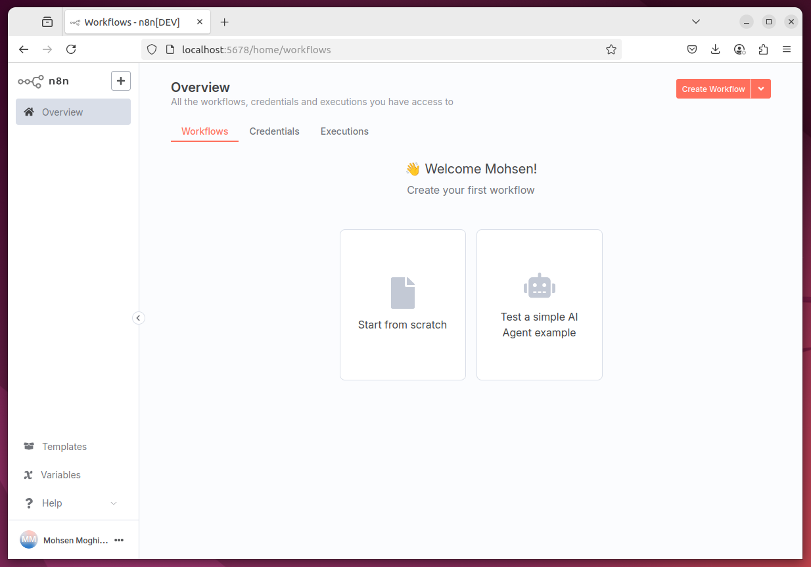

# n8n_adv


#### Befor Instalation

Check the following before installation:
```bash
node -v
npm -v
n8n --version
```

#### Instalation `n8n`

Add `--verbose` to see detailed logs and identify where it's getting stuck
```bash
npm install n8n -g
```

#### Run `n8n`

Now you can run `n8n` locally
```bash
n8n
```

#### Sample of `n8n` environment

<p align="center">

</p>

#### uninstall

To unistall it, use following command
```bash
sudo npm uninstall -g n8n
```
